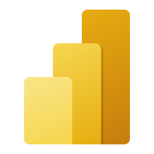

  

# 🧭 MedFlow Compass: Navigating Insights in Healthcare Payments 💡

**MedFlow Compass** is a personal data engineering project designed to guide users through the complex landscape of healthcare payments using the CMS Open Payments Dataset. 🌐 Initially created to promote transparency between healthcare providers and the pharmaceutical/medical device industries, this dataset is a wealth of information on general payments, research funding, and physician ownership interests.

With **MedFlow Compass**, you can chart 📊 high-level trends in healthcare payments across various specialties, assess policy impacts, and explore industry behaviors. Whether you’re a policymaker, researcher, healthcare provider, or an informed member of the public, this tool helps you navigate the data and discover actionable insights. 🔍

### What MedFlow Compass Offers:
- 🖥️ **Interactive Dashboard for Trend Discovery**: Visualize key trends in healthcare payments, research funding, and compliance metrics, making it simple to spot emerging patterns and behaviors. (Coming Soon)
- 📥 **Downloadable Data for Independent Exploration**: Access clean, ready-to-analyze datasets, allowing deeper dives into specific questions or personal analysis. (Coming Soon)
- 🚀 **Easy Navigation**: Focus on high-level trends with intuitive filters for specialties, regions, and payment categories, making the complex data landscape easier to explore. (Coming Soon)

### Powered By:

  
  
  
  
  

Built using **Microsoft Fabric**'s comprehensive tools, including **PySpark**, **Synapse**, **Notebooks**, and **PowerBI**, **MedFlow Compass** offers a scalable and efficient way to process, visualize, and share insights. ⚙️

### Dataset Overview:
- 💼 **General Payments**: Discover insights from 65 variables related to non-research payments, such as consulting fees and travel reimbursements.
- 🧪 **Research Payments**: Analyze 166 variables detailing payments connected to research agreements.
- 📈 **Physician Ownership**: Investigate 29 variables tracking ownership or investment interests of healthcare providers in the pharmaceutical and device sectors.

Whether you're asking questions like "Which specialties receive the most research funding?" or "How do payment patterns shift geographically?" **MedFlow Compass** will help you find your way through the data. 🛠️
